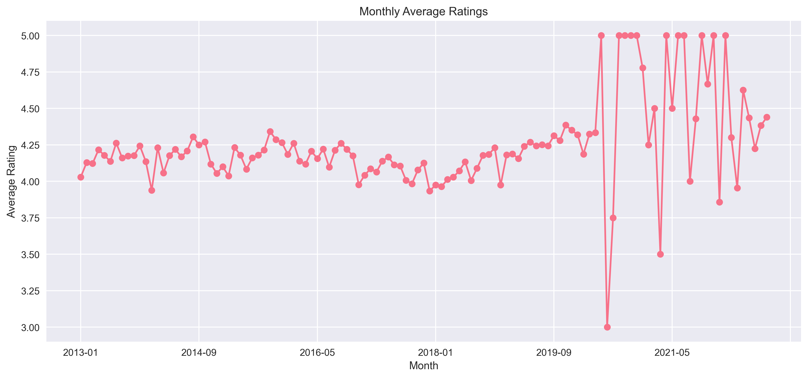

# Tourism Experience Analytics System

## Skills Utilized
1. Data Cleaning and Preprocessing
2. Exploratory Data Analysis (EDA)
3. Data Visualization
4. SQL
5. Streamlit
6. Machine Learning (Regression, Classification & Recommendation)

## Domain
Tourism

Problem Statement:
Tourism agencies and travel platforms aim to enhance user experiences by leveraging data to provide personalized recommendations, predict user satisfaction, and classify potential user behavior. 
This project involves analyzing user preferences, travel patterns, and attraction features to achieve three primary objectives: regression, classification, and recommendation.



## 📌 Overview
A Streamlit-powered recommendation system that predicts:
- Visitor types (Business/Family/Solo)
- Attraction ratings (1-5 stars)
- Personalized attraction recommendations

## Business Use Cases:
1. Personalized Recommendations: Suggest attractions based on users' past visits, preferences, and demographic data, improving user experience.
2. Tourism Analytics: Provide insights into popular attractions and regions, enabling tourism businesses to adjust their offerings accordingly.
3. Customer Segmentation: Classify users into segments based on their travel behavior, allowing for targeted promotions.
4. Increasing Customer Retention: By offering personalized recommendations, businesses can boost customer loyalty and retention.

# Approach:
## Data Cleaning:
- Handle missing values in the transaction, user, and city datasets.
- Resolve discrepancies in city names or other categorical variables like VisitMode, AttractionTypeId, etc.
- Standardize date and time format, ensuring consistency across data.
- Handle outliers or any incorrect entries in rating or other columns.

## Preprocessing:
###  Feature Engineering:
- Encode categorical variables such as VisitMode, Continent, Country, and AttractionTypeId.
- Aggregate user-level features to represent each user's profile (e.g., average ratings per visit mode).
- Join relevant data from transaction, user, city, and attraction tables to create a consolidated dataset.
### Normalization: Scale numerical features such as Rating for better model convergence.

## Exploratory Data Analysis (EDA):
- Visualize user distribution across continents, countries, and regions.
- Explore attraction types and their popularity based on user ratings.
- Investigate correlation between VisitMode and user demographics to identify patterns.
- Analyze distribution of ratings across different attractions and regions.

## Model Training:
### Regression Task:
Train a model to predict ratings based on user, attractions, transaction features, etc.

### Classification Task:
Train a classifier (e.g., Random Forest, LightGBM, or XGBoost) to predict VisitMode based on user and transaction features.

### Recommendation Task:
- Implement collaborative filtering (using user-item matrix) to recommend attractions based on user ratings and preferences.
- Alternatively, use content-based filtering based on attractions' attributes (e.g., location, type).


## Model Evaluation:
- Evaluate classification model performance using accuracy, precision, recall, and F1-score.
- Evaluate regression model using R2, MSE, etc.
- Assess recommendation system accuracy using metrics like Mean Average Precision (MAP) or Root Mean Squared Error (RMSE).

## Deployment:
1. Build a Streamlit app that allows users to input their details (location, preferred visit mode) and receive:
2. A prediction of their visit mode (Business, Family, etc.).
3. Recommended attractions based on their profile and transaction history.
4. Display visualizations of popular attractions, top regions, and user segments in the app.

## End Output:
A user-friendly Streamlit application where tourists can input their data and receive personalized recommendations for attractions, as well as get predictions on their likely visit mode.


## 🛠️ Installation
```bash
git clone https://github.com/yasser0311/Tourism_Experience_Analytics.git
cd Tourism_Experience_Analytics
pip install -r requirements.txt

## 📂 File Structure
├── app.py                      # Main Streamlit application
├── *.ipynb                     # Analysis notebooks
├── Visualizations/             # Charts and graphs
├── tourism_models/             # ML models 
└── preprocessed_tourism_data.csv # Processed dataset

## 🔧 Setup Missing Files

Visit Google Drive : https://drive.google.com/drive/folders/1wgJGc6SEiyjKYM-q33zjYGY8CbqBgVv5?usp=drive_link
Download models:
Place in tourism_models/

Original datasets:
Place in Datasets/

## 🚀 Usage
streamlit run app.py


